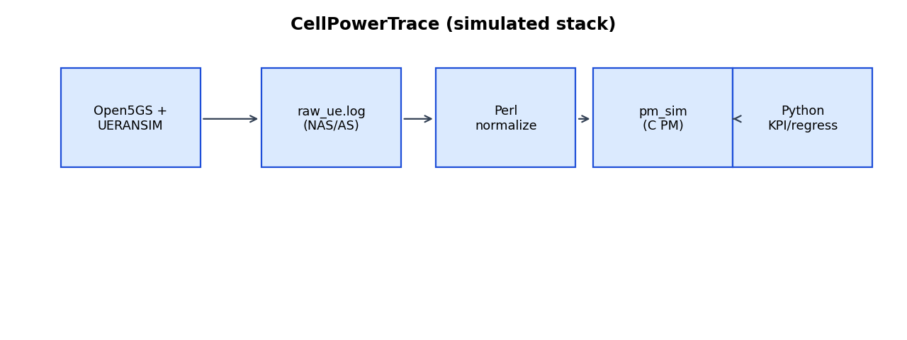
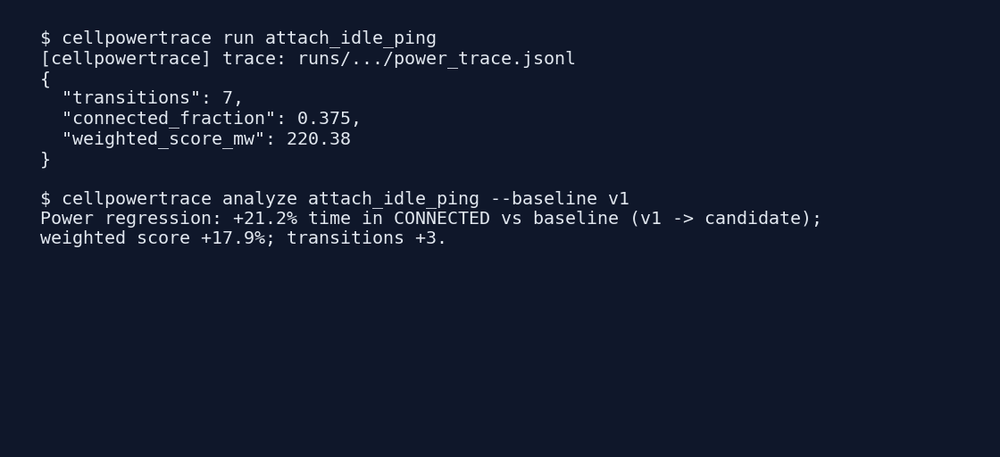
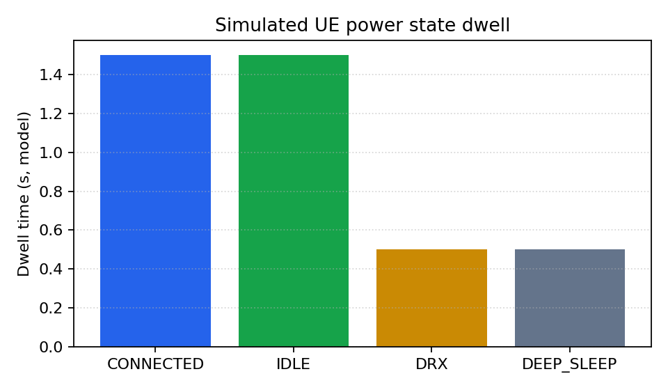

# CellPowerTrace

[](https://github.com/chaffybird56/CellPowerTrace/actions/workflows/ci.yml)
[](LICENSE)
[](https://www.python.org/)
[](pipeline/perl/)
[](docker/)

Cellular power regression analyzer for **simulated** 5G UE stacks. Runs attach → idle → traffic → idle scenarios, maps NAS/AS-style events through a userspace power-state simulator, and reports KPIs plus baseline deltas.

analyzed open-source / simulated cellular logs (Open5GS, UERANSIM); built a simulated modem PM interface and Perl/Python tooling—not Qualcomm production modem firmware or handset QXDM captures.



## What this demonstrates

| Gap (typical role) | This repo (software-only) |
|--------------------|---------------------------|
| Modem logs | Parse UERANSIM-style / curated sample UE logs |
| PM drivers | C `pm_sim` state machine (IDLE, CONNECTED, DRX, DEEP_SLEEP) |
| NAS / AS | Event hooks on Registration*, RRC*, traffic lines |
| Perl | `normalize_logs.pl` telecom-style text preprocessing |
| Deliverable | CLI regression: % time in CONNECTED vs baseline |

## Quickstart (offline, no Docker)

```bash
git clone https://github.com/chaffybird56/CellPowerTrace.git && cd CellPowerTrace
bash scripts/setup.sh
source .venv/bin/activate

cellpowertrace run attach_idle_ping
cellpowertrace analyze attach_idle_ping --baseline v1
```

Example regression line:

```text
Power regression: +21.2% time in CONNECTED vs baseline (v1 -> candidate);
weighted score +17.9%; transitions +3.
```

## Screenshots

**CLI output** — run + analyze against bundled sample logs:



**KPI chart** — modeled dwell time per power state:



## Repository layout

```
docker/                 # Open5GS + UERANSIM Compose (optional live capture)
scenarios/              # attach_idle_ping.yaml, attach_idle_short.yaml
pm_driver/              # Simulated PM (C): pm_sim
pipeline/perl/          # normalize_logs.pl
pipeline/python/        # cellpowertrace CLI, KPI, regression
samples/logs/           # Offline UE logs for CI and demos
scripts/                # setup.sh, run_scenario.sh
docs/                   # ARCHITECTURE.md, images/
```

## Live stack (optional)

```bash
USE_DOCKER=1 ./scripts/run_scenario.sh attach_idle_ping
# Capture: docker logs cpt-ueransim 2>&1 | tee runs/<id>/raw_ue.log
cellpowertrace run attach_idle_ping   # after raw log exists
```

Requires Docker; images are large. CI and quickstart use `samples/logs/` only.

## Scenarios

| File | Purpose |
|------|---------|
| `attach_idle_ping.yaml` | Full attach / idle / ping / detach |
| `attach_idle_short.yaml` | Fast path for CI |

## Pipeline

1. `run_scenario.sh` — copy sample or point at Docker UE log  
2. `normalize_logs.pl` — JSONL events (NAS, AS, PM, traffic)  
3. `pm_sim` — unified `power_trace.jsonl`  
4. `cellpowertrace` — KPI JSON + regression vs baseline  

Details: [docs/ARCHITECTURE.md](docs/ARCHITECTURE.md)

## Regenerate doc images

```bash
cellpowertrace run attach_idle_ping
python3 scripts/generate_docs_images.py
```

## License

MIT — see [LICENSE](LICENSE).
